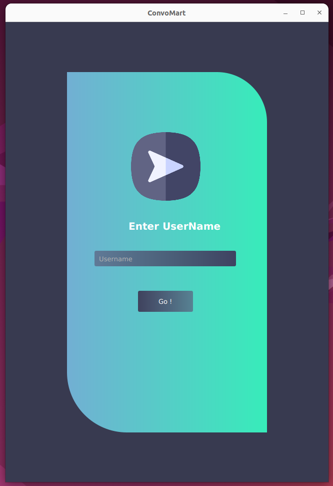

# ConvoMart Chat Application
ConvoMart is a user-friendly public chat application designed for seamless real-time communication on desktop devices. Built on a robust client-server architecture, it utilizes TCP sockets and a custom application layer protocol over TCP to ensure reliable and efficient message delivery.

Ideal for online communities, remote teams, or casual chatting with friends, ConvoMart offers a flexible and customizable solution that caters to diverse communication needs.

### Key Features

- **Real-Time Messaging**: 
  - Enables smooth and concurrent messaging, allowing fast-paced and interactive chats.
  

- **Multiple User Support**: 
  - Allows multiple users to exchange messages simultaneously with concurrent access.
  
  
- **Enhanced Text and Emoji Sharing**:
	- Express yourself with both text messages and a well-organized emoji library.
	- Craft multi-line messages, allowing for separation and better readability.
	- Personalize your emoji experience by customizing their colors.
	- Quickly find and insert emojis with a convenient search feature.
  
  
- **Dynamic User Management**:
	- Display a dynamic list of currently connected users, providing a clear overview of who's online.
	- Be alerted when users join or exit the chat, ensuring awareness of chat participants. (ensuring everyone stays in sync.)
	- New joiners receive a comprehensive chat history, providing context for ongoing conversations.

### Technologies Used
- Java : Java SE library API (Input/Output, Networking), JDK 8, Intellij Idea
- JavaFX (OpenJFX): Gluon Scene Builder

### Application Preview

### License

This project is licensed under the [MIT license](LICENSE).
