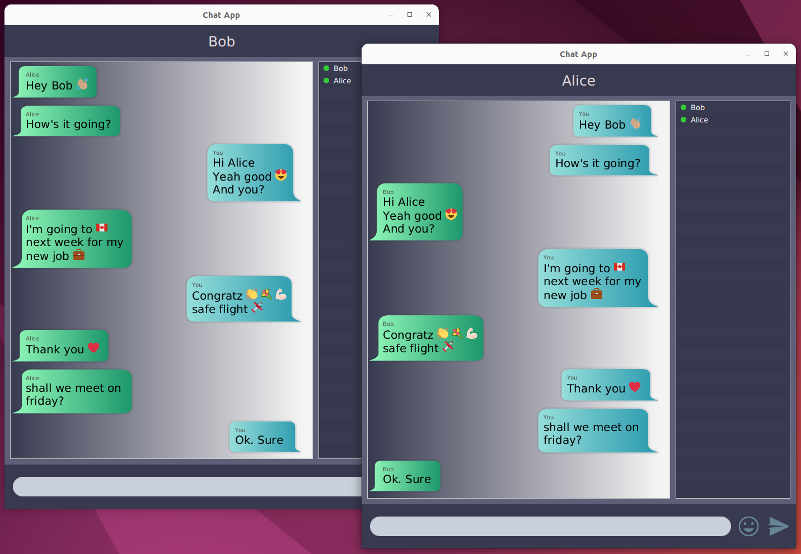

# ConvoMart Chat Application
A simple public chat application for desktop. The data is shared having an active connection opened between the client and the server according to the **client-server architecture**.
This allows real-time communication using TCP sockets and an **application layer protocol** which was defined on TCP

- Multiple users can share text messages and emojis with concurrent access
- If a new user joins, let the other users connected with server know and if someone leaves the chat, let others know.
- Broadcast chat history to newly logged users

### Technologies Used
- Java : Java SE library API (Input/Output, Networking), JDK 11, Intellij Idea
- JavaFX (OpenJFX): Gluon Scene Builder

### Application Preview

### License

This project is licensed under the [MIT license](LICENSE).
